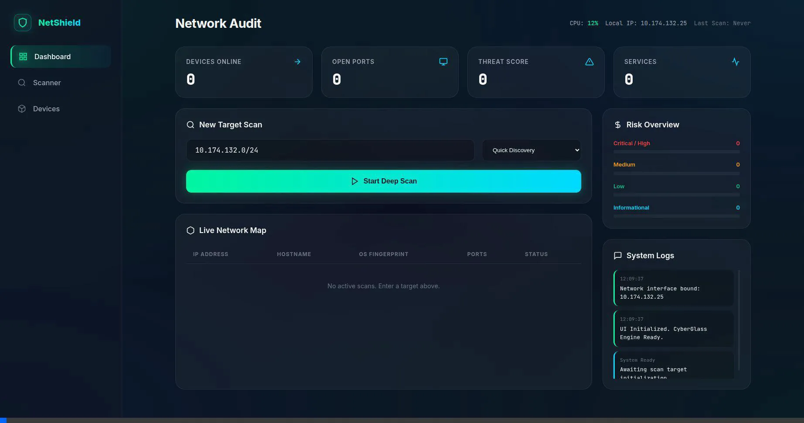
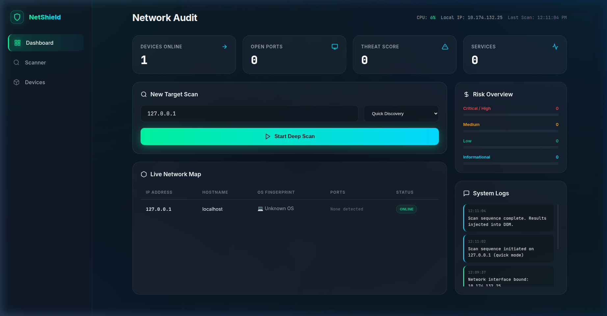

# 🛡️ NetShield — Home Network Security Audit Tool

> Scan your local network for devices, open ports, running services, and potential security vulnerabilities — all from a stunning web dashboard.


---

## 🚀 Features

### 📺 Live Demo


### 📸 Interface Preview


| Feature | Description |
|---------|-------------|
| ⚡ **Quick Scan** | Fast host discovery on your local network |
| 🔌 **Port Scan** | Scan top 100 TCP ports |
| 🔬 **Full Scan** | Service/version detection + OS fingerprinting |
| 🛡️ **Vuln Scan** | Vulnerability scripts for deeper analysis |
| 📊 **Risk Assessment** | Automatic risk scoring (High/Medium/Low/Info) |
| 💾 **JSON Export** | Download scan results as structured JSON |
| 🎨 **Cyber UI** | Dark glassmorphism dashboard with neon accents |

---

## 🛠️ Tech Stack

- **Backend**: Python 3, Flask, python-nmap
- **Scanner**: Nmap (system binary)
- **Frontend**: HTML5, Vanilla CSS, JavaScript
- **Design**: Glassmorphism, CSS animations, responsive layout

---

## 📦 Installation

### Prerequisites

1. **Python 3.10+**
2. **Nmap** must be installed on your system:

```bash
# Ubuntu / Debian
sudo apt update && sudo apt install nmap

# Fedora / RHEL
sudo dnf install nmap

# macOS
brew install nmap
```

### Setup

```bash
# Clone the project
git clone https://github.com/yourusername/home-network-security-audit-tool.git
cd home-network-security-audit-tool

# Install Python dependencies
pip install -r requirements.txt

# Run the application
python3 app.py
```

Open your browser at **http://localhost:5000** 🌐

---

## 🖥️ Usage

1. **Auto-fill** your local subnet with the 🔗 button, or manually enter a target IP/range
2. **Select scan type** — Quick, Port, Full, or Vulnerability
3. Click **Start Scan** and watch the radar animation
4. View discovered **devices**, **open ports**, **services**, and **risk levels**
5. **Export** results as JSON for documentation

---

## 📁 Project Structure

```
📂 Home Network Security Audit Tool
├── app.py              # Flask server & API endpoints
├── scanner.py          # Nmap scanner wrapper
├── utils.py            # Validation & helper utilities
├── requirements.txt    # Python dependencies
├── README.md
├── templates/
│   └── index.html      # Dashboard page
└── static/
    ├── css/
    │   └── style.css   # Dark cybersecurity theme
    └── js/
        └── app.js      # Frontend logic
```

---

## ⚠️ Security Notes

- This tool is designed for **authorized scanning of your own network** only
- Some scan types require **root/sudo** privileges for advanced features
- Never scan networks you don't own or have permission to scan
- Keep the tool on your local network — don't expose port 5000 publicly

---

## 📄 License

MIT License — free for personal and educational use.
